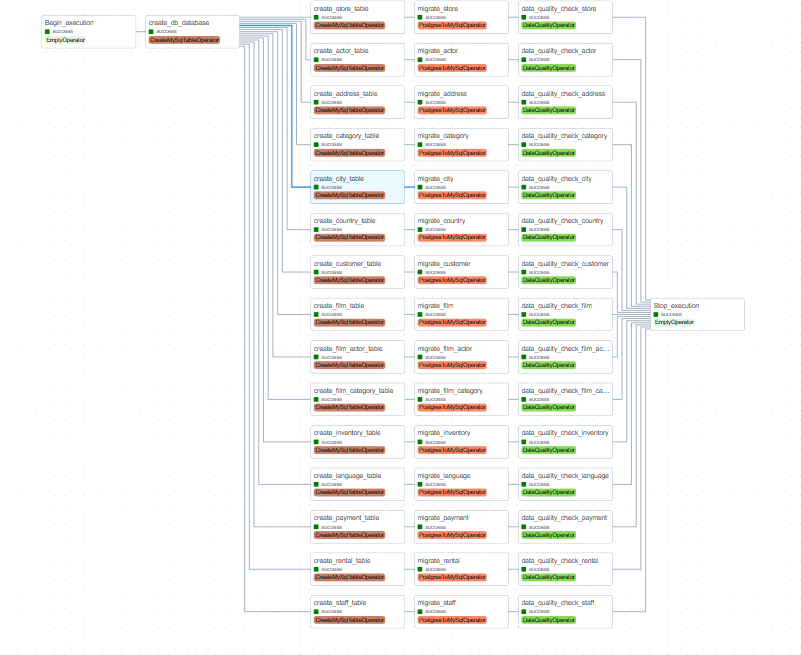

# Migrate Pagila Data from PostgreSQL to MySQL

## Overview

This Apache Airflow project automates the migration of data from PostgreSQL to MySQL for the Pagila database. Consists of a sequence of tasks for creating MySQL tables, migrating data, and performing data quality checks.

**Incremental Data Load**: It's important to note that this data migration process is designed to perform an incremental data load. This means that only the new or modified data records since the last execution will be transferred from PostgreSQL to MySQL by checking the last_update time or any equivalent column in each run. This approach minimizes data transfer time and resource utilization.

## DAG

  

## Custom Operators

The following custom operators were developed:

- **DataQualityOperator**: A custom operator for performing data quality checks on the migrated data.

- **CreateMySqlTableOperator**: A custom operator for creating MySQL tables from SQL queries.

- **PostgresToMySqlOperator**: A custom operator for migrating data from PostgreSQL to MySQL, providing flexibility in handling data transformations.

## Tasks

### 1. Begin Execution

- Task ID: Begin_execution
- Description: Start of the data migration process.

### 2. Create MySQL Database

- Task ID: create_db_database
- Description: Creates the MySQL database for storing the Pagila data.

### 3. Table Creation and Data Migration

The following tables from the Pagila database are migrated:

    - actor
    - address
    - category
    - city
    - country
    - customer
    - film
    - film_actor
    - film_category
    - inventory
    - language
    - payment
    - rental
    - staff
    - store

For each table, the following tasks are performed:

- Create MySQL Table: Creates the corresponding MySQL table.

- Data Migration: Migrates data from PostgreSQL to MySQL.

### 4. Data Quality Checks

- Data Quality Check tasks are performed for each migrated table to ensure data integrity.
- The following checks are executed:
  - Check for NULL values in the last_update column.
  - Check the total count of records in the MySQL table.

### 5. Stop Execution

- Task ID: Stop_execution
- Description: End of the data migration process.

## Default Configuration

    - Owner: Hassib
    - Start Date: October 31, 2023
    - Schedule Interval: Daily (At midnight)
    - Catchup: Disabled
    - Retries: 3
    - Retry Delay: 5 minutes
    - Email Notifications on Retry: Disabled

## Prerequisites

Before executing this Project, make sure to set up the required containers using Docker Compose. Here are the steps to do so:
1. Navigate to the project directory:
    - `docker-compose up -d`
        - This will launch the following containers:
            - PostgreSQL: The source database from which data will be migrated.
            - MySQL: The destination database where the data will be migrated.
            - Apache Airflow and postgres metadata database.
2. Create the source database:
    - `docker exec -it db-postgres psql -U postgres`
    - `CREATE DATABASE source;`
    - `\q`
3. Load the source data:
    - `cat source.sql | docker exec -i db-postgres psql -U postgres -d source`

<!--             
- PostgreSQL connection (PostgreSQL database to migrate from)
- MySQL connection (MySQL database to migrate to) -->

## Configure Apache Airflow Connections

Before running the DAG, it's essential to configure the required connections in Apache Airflow.

### 1. MySQL Connection Configuration

1. **Connection Id:** `mysql`

1. **Host:** `db-mysql`

2. **Login:** `root`

3. **Password:** `root`

4. **Port:** `3306`

### 2. PostgreSQL Connection Configuration

1. **Connection Id:** `postgres`

1. **Host:** `db-postgres` 

2. **Schema:** `source`

3. **Login:** `postgres`

4. **Password:** `postgres`

5. **Port:** `5432`

### 3. Monitor the progress and data quality checks via the Airflow web interface.

## Code Directory Structure
    migrate-pagila-to-mysql/
    │
    ├── dags/
    │   ├── Migrate_postgres_to_mysql.py
    │
    ├── plugins/ `contains your custom operator implementations`
    │    ├── operators/
    │    │   ├── data_quality.py
    │    │   ├── create_mysql_table.py
    │    │   ├── postgres_to_mysql.py
    │    │
    │    ├── helpers/
    │    │   ├── sql_queries.py
    │
    ├── README.md
    ├── docker-compose.yaml
    ├── souece.sql

